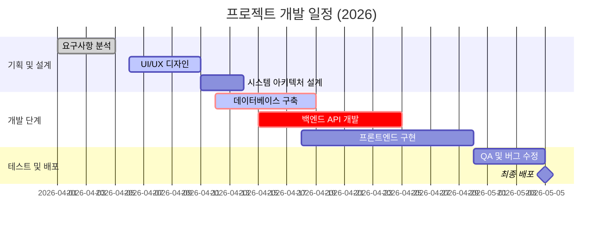

# vibe

```
안녕하세요
```

```python
print('hello')
```


```mermaid
gantt
    title 프로젝트 개발 일정 (2026)
    dateFormat  YYYY-MM-DD
    section 기획 및 설계
    요구사항 분석          :done,    des1, 2026-04-01, 2026-04-05
    UI/UX 디자인           :active,  des2, 2026-04-06, 5d
    시스템 아키텍처 설계    :         des3, after des2, 3d

    section 개발 단계
    데이터베이스 구축      :crit, active, 2026-04-12, 7d
    백엔드 API 개발        :crit, 2026-04-15, 10d
    프론트엔드 구현        :2026-04-18, 12d

    section 테스트 및 배포
    QA 및 버그 수정        :2026-04-30, 5d
    최종 배포             :milestone, 2026-05-05, 0d
```
